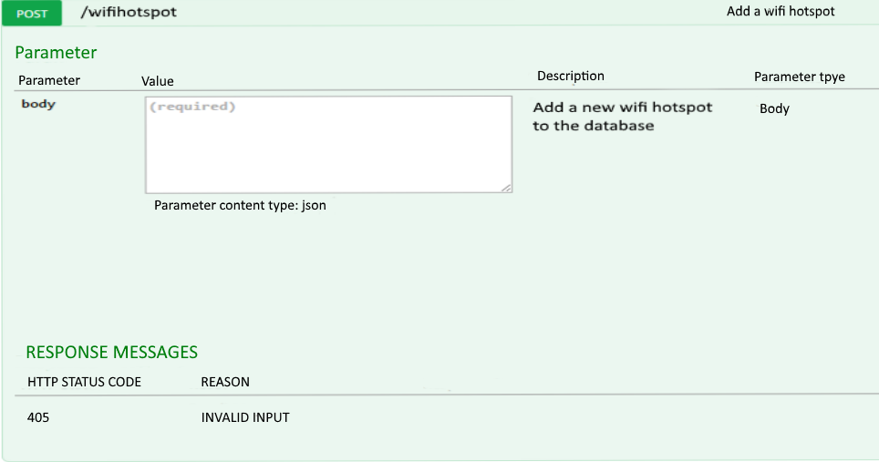
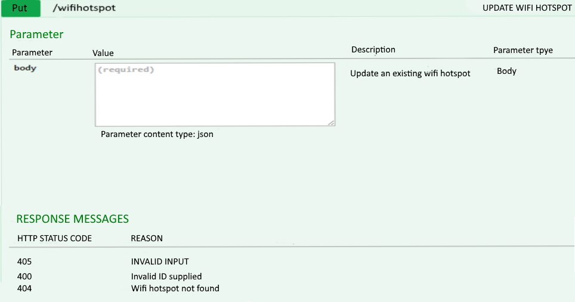
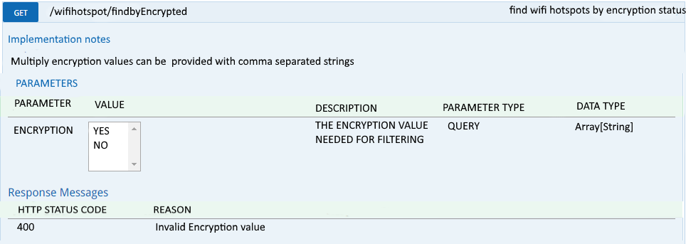
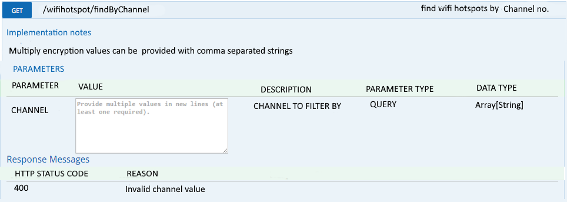
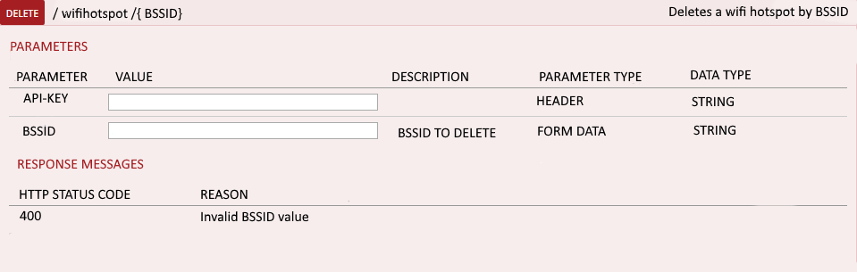
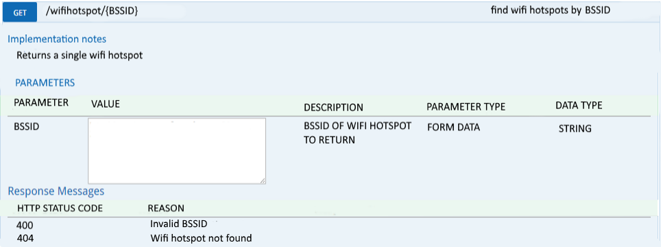
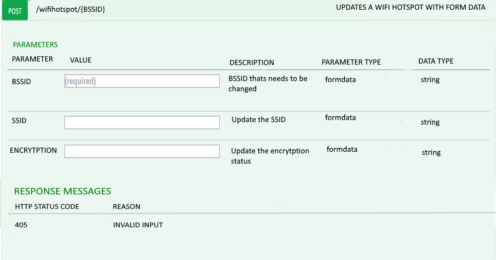

# Data-Project
# Wifi Hotspots in Dublin API
## Data Representation and Querying Project 2015
### Manus Duggan

## Introduction
This project provides the design and documentation for the dataset "WiFi Hotspots in Dublin City" which is available at [data.gov.ie](http://data.gov.ie).The Designer of the dataset has said it is:
>"A mapping of the publicly visible WiFi access points in the city centre. The dataset consists of two records, one detailing all the access points visible at any point, and secondly a list of access points and some information about them with estimated locations. The mapping was undertaken over the summer of 2013. The initial mapping and related software was implemented by Dean Leavy, a student of NUI Maynooth under the direction of Dr. Ronan Farrell. The area covered is small but we plan to extend the map and develop a crowdsourcing aspect to help keep it up to date. We welcome contributions from anyone willing to provide maps and data in the required format."

###For reference, i have attached the following files:
* [*BSSID-DATA.csv*](https://github.com/mysterydeveloper/Data-Project/blob/master/BSSID-DATA.csv).

## About the data
This dataset was received in Comma Separated Values (CSV) format, and was downloaded from [*WiFi Hotspots in Dublin City*](https://data.gov.ie/dataset/wifi-hotspots-in-dublin-city).
The CSV file contains 17026 rows, the first being a header row with the names of each field.
There are six values on each line, which are as follows

| Field Name        | About           |
| ------------- |:-------------| 
| BSSID     | The unique address that identifies the access point that creates the Wifi hotspot. | 
| SSID   |  The name of the network (for legal reasons it isnt allowed to be shown)     |  
| CHANNEL | The channel the wifi hotspot is on      | 
| RADIO TYPE |  The type of radio the wifi hotspot is using    | 
| ENCRYPTION | If the wifi hotspot is encrypted or not    | 
| LONGTITUDE | Longtitude that the wifi hotspot is.    | 
| LATTITUDE | Lattitude that the wifi hotspot is.    | 

## Methods
###POST /wifihotspot 


* ####_Request Url_
 http://Dublin.wifihotspot.ie/v1/wifihotspot

* ####_CURL_
curl -X POST --header "Content-Type: application/json" --header "Accept: application/json" -d "{
 \"BSSID\":\"00:24:92:5e:86:30\",
       \"SSID\":\"        \",
       \"Channel\":\"1\",
       \"RadioType\":\"OFDM24\",
       \"Encryption\":\"YES\",
       \"Longitude\":\"00615.9477W\",
       \"lattitude\":\"5320.6598N\"
}" " http://Dublin.wifihotspot.ie/v1/wifihotspot"

* ####__Response Body__
 ```json
 [
    {
       "BSSID":"00:24:92:5e:86:30",
       "SSID":"        ",
       "Channel":"1",
       "RadioType":"OFDM24",
       "Encryption":"YES",
       "Longitude":"00615.9477W",
       "lattitude":"5320.6598N"
     }
  ]
 ```

* ####_Response Code_
>200

###PUT / wifihotspot


* ####_Request Url_
  http://Dublin.wifihotspot.ie/v1/wifihotspot

* ####_CURL_
 curl -X PUT --header "Content-Type: application/json" --header "Accept: application/json" -d "{
  \"BSSID\":\"00:24:92:5e:86:30\",
        \"SSID\":\"        \",
        \"Channel\":\"1\",
        \"RadioType\":\"OFDM24\",
        \"Encryption\":\"YES\",
        \"Longitude\":\"00615.9477W\",
        \"lattitude\":\"5320.6598N\"
 }" " http://Dublin.wifihotspot.ie/v1/wifihotspot"

* ####__Response Body__
 ```json
 [
    {
       "BSSID":"00:24:92:5e:86:30",
       "SSID":"        ",
       "Channel":"2",
       "RadioType":"OFDM24",
       "Encryption":"YES",
       "Longitude":"00615.9477W",
       "lattitude":"5320.6598N"
     }
  ]
 ```

* ####_Response Code_
>200

###GET / wifihotspot /findByEncypted 


* ####_Request Url_
 http://Dublin.wifihotspot.ie/v1/wifihotspot/findByEncypted?encryption=no

* ####_CURL_
curl -X GET --header "Accept: application/json" "http://Dublin.wifihotspot.ie/v1/wifihotspot/findByEncypted?encryption=no"

* ####__Response Body__
 ```json
 [
    {
       "BSSID":"00:02:6f:b1:39:0b",
       "SSID":"        ",
       "Channel":"6",
       "RadioType":"OFDM24",
       "Encryption":"None",
       "Longitudde":"00615.9583W",
       "lattitude":"5320.6587N"
     }
     {
       "BSSID":"00:27:22:82:9a:c3",
       "SSID":"        ",
       "Channel":"11",
       "RadioType":"OFDM24",
       "Encryption":"None",
       "Longitudde":"00615.9498W",
       "lattitude":"5320.7018N"
     }
     .
     .
     .
  ]
 ```
 
* ####_Response Code_
>200

###GET / wifihotspot /findByChannel 


* ####_Request Url_
 http://Dublin.wifihotspot.ie/v1/wifihotspot/findByChannel?channel=6%2C1%2C11

* ####_CURL_
curl -X GET --header "Accept: application/json" "http://Dublin.wifihotspot.ie/v1/wifihotspot/findByChannel?channel=6%2C1%2C11"

* ####__Response Body__
  ```json
  [
     {
        "BSSID":"00:24:92:db:52:b0",
        "SSID":"        ",
        "Channel":"1",
        "RadioType":"OFDM24",
        "Encryption":"YES",
        "Longitudde":"5320.6731N",
        "lattitude":"00615.9428W"
      }
      {
        "BSSID":"d6:ca:6d:11:81:75",
        "SSID":"        ",
        "Channel":"6",
        "RadioType":"OFDM24",
        "Encryption":"YES",
        "Longitudde":"00615.9549W",
        "lattitude":"5320.6720N"
      }
      {
       "BSSID":"00:27:22:82:9a:c3",
       "SSID":"        ",
       "Channel":"11",
       "RadioType":"OFDM24",
       "Encryption":"None",
       "Longitudde":"00615.9498W",
       "lattitude":"5320.7018N"
     }
      .
      .
      .
   ]
  ```

* ####_Response Code_
>200

###DELETE / wifihotspot /{ BSSID} Deletes a wifi hotspot by BSSID


* ####_Request Url_
http://Dublin.wifihotspot.ie/v1/wifihotspot/00:24:92:5e:86:30

* ####_CURL_
* curl -X DELETE --header "Accept: application/json" "http://Dublin.wifihotspot.ie/v1/wifihotspot/00:24:92:5e:86:30"

* ####__Response Body__
>no content

* ####_Response Code_
>200

###GET / wifihotspot /{ BSSID }


* ####_Request Url_
http://Dublin.wifihotspot.ie/v1/wifihotspot/00:24:92:5e:86:30

* ####_CURL_
curl -X GET --header "Accept: application/json" "http://Dublin.wifihotspot.ie/v1/wifihotspot/00:24:92:5e:86:30"

* ####__Response Body__
 ```json
  [
     {
        "BSSID":"00:24:92:5e:86:30",
        "SSID":"        ",
        "Channel":"1",
        "RadioType":"OFDM24",
        "Encryption":"YES",
        "Longitude":"00615.9477W",
        "lattitude":"5320.6598N"
      }
   ]
  ```
 
* ####_Response Code_
>200

###POST / wifihotspot /{ BSSID }


* ####_Request Url_
 http://Dublin.wifihotspot.ie/v1/wifihotspot/00:24:92:5e:86:30

* ####_CURL_
 curl -X POST --header "Content-Type: application/x-www-form-urlencoded" --header "Accept: application/json" -d "SSID=hello&ENCRYPTION=no" "http://Dublin.wifihotspot.ie/v1/wifihotspot/00:24:92:5e:86:30"

* ####__Response Body__
 ```json
 [
    {
       "BSSID":"00:24:92:5e:86:30",
       "SSID":"HELLO WORLD ",
       "Channel":"2",
       "RadioType":"OFDM24",
       "Encryption":"YES",
       "Longitude":"00615.9477W",
       "lattitude":"5320.6598N"
     }
  ]
 ```
 
* ####_Response Code_
>200


  ##LINKS
  http://www.slashroot.in/curl-command-tutorial-linux-example-usage
