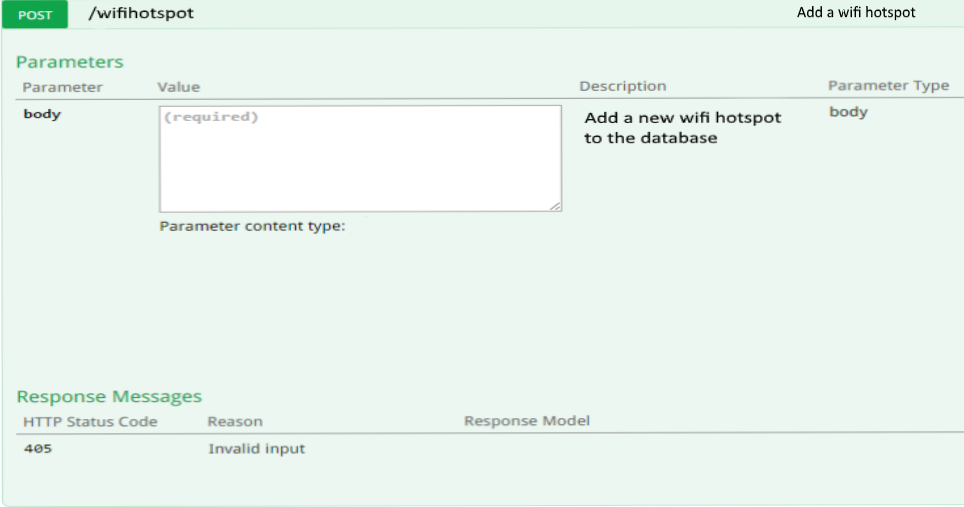
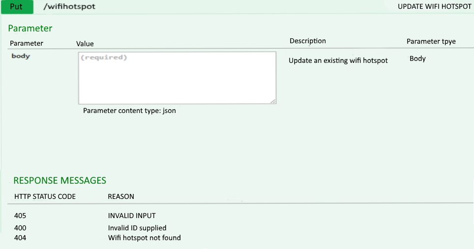
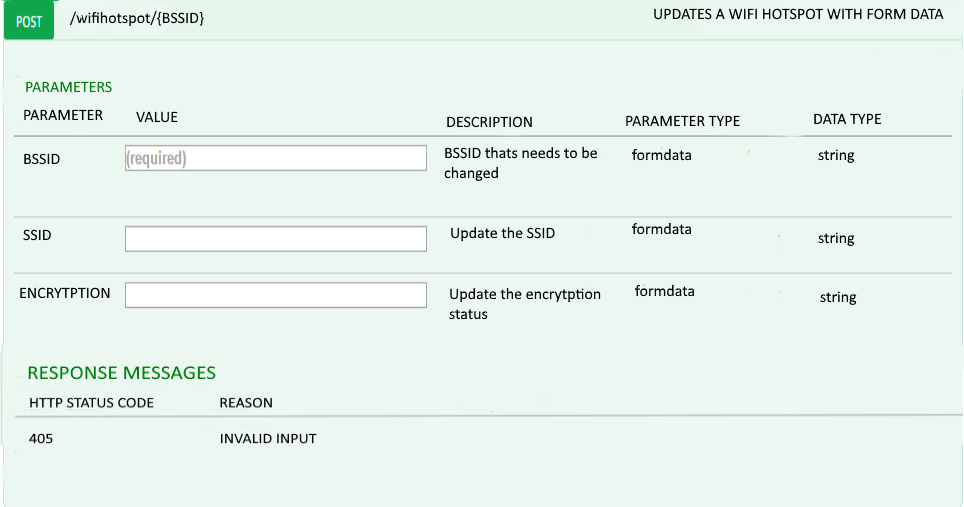

# Data-Project
# Wifi Hotspots in Dublin API
## Data Representation and Querying Project 2015
### Manus Duggan

## Introduction
This project provides the design and documentation for the dataset "WiFi Hotspots in Dublin City" which is available at [data.gov.ie](http://data.gov.ie)

## About the data
This dataset was received in Comma Separated Values (CSV) format, and was downloaded from [*WiFi Hotspots in Dublin City*](https://data.gov.ie/dataset/wifi-hotspots-in-dublin-city).
The CSV file contains 17026 rows, the first being a header row with the names of each field.
There are six values on each line, which are as follows

| Field Name        | About           |
| ------------- |:-------------| 
| BSSID     | The unique address that identifies the access point that creates the Wifi hotspot. | 
| SSID   |  The name of the network (for legal reasons it isnt allowed to be shown)     |  
| CHANNEL | The channel the wifi hotspot is on      | 
| RADIO TYPE |  The type of radio the wifi hotspot is using    | 
| ENCRYPTION | If the wifi hotspot is encrypted or not    | 
| LATTITUDE | Lattitude that the wifi hotspot is.    | 
| LONGTITUDE | Longtitude that the wifi hotspot is.    | 

## List of cars for a given year
You can get a list of cars purchased in a given year using the GET method at the following URL:
*http://carsapi.com/year/[year]*
where you replace [year] with the year.
For example, the URL:
*http://carsapi.com/year/2005*
will return a list of cars purchased in 2005.
The data will be returned in JSON format, with the following properties for each car:
    - *price*: the price of the car.
    - *model*: the model of the car.
    ...
An example of a response would be:
    ```json
    [ {"price": 20000, "model": "Skoda", ...}, {...}, ...]
    ```  
## Methods
###POST /wifihotspot 


###PUT / wifihotspot Update an existing wifi hotspot


###GET / wifihotspot /findByEncypted Finds wifi hotspot by Encypted status

###GET / wifihotspot /findByChannel Finds wifi hotspot by Channel No.

###DELETE / wifihotspot /{ BSSID} Deletes a wifi hotspot by BSSID

###GET / wifihotspot /{ BSSID } Find wifi hotspot by BSSID

###POST / wifihotspot /{ BSSID } Updates a BSSID in the wifi hotspot with form data



  
