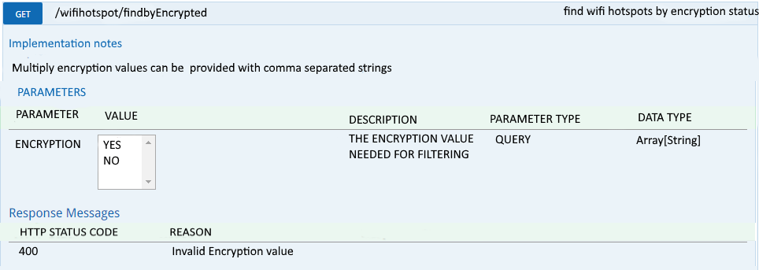
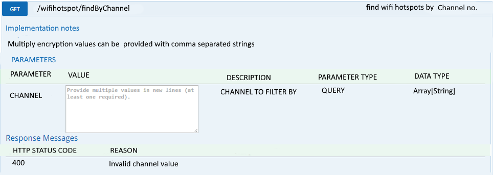
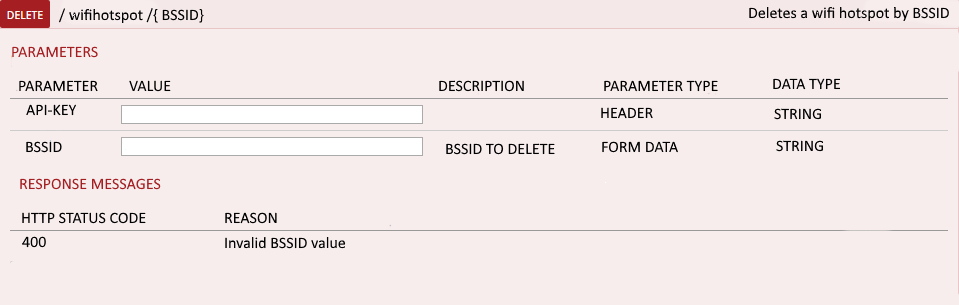
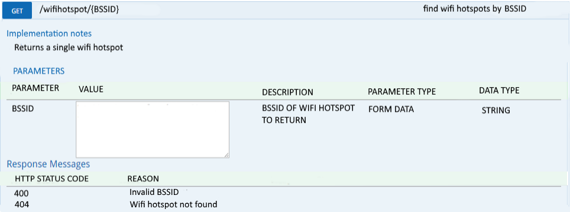

# Data-Project
# Wifi Hotspots in Dublin API
## Data Representation and Querying Project 2015
### Manus Duggan

## Introduction
This project provides the design and documentation for the dataset "WiFi Hotspots in Dublin City" which is available at [data.gov.ie](http://data.gov.ie)

## About the data
This dataset was received in Comma Separated Values (CSV) format, and was downloaded from [*WiFi Hotspots in Dublin City*](https://data.gov.ie/dataset/wifi-hotspots-in-dublin-city).
The CSV file contains 17026 rows, the first being a header row with the names of each field.
There are six values on each line, which are as follows

| Field Name        | About           |
| ------------- |:-------------| 
| BSSID     | The unique address that identifies the access point that creates the Wifi hotspot. | 
| SSID   |  The name of the network (for legal reasons it isnt allowed to be shown)     |  
| CHANNEL | The channel the wifi hotspot is on      | 
| RADIO TYPE |  The type of radio the wifi hotspot is using    | 
| ENCRYPTION | If the wifi hotspot is encrypted or not    | 
| LATTITUDE | Lattitude that the wifi hotspot is.    | 
| LONGTITUDE | Longtitude that the wifi hotspot is.    | 

## Methods
###POST /wifihotspot 


* ####_Request Url_
 http://Dublin.wifihotspot.ie/v1/wifihotspot

* ####__Response Body__
 ```json
 [
    {
       "BSSID":"00:24:92:5e:86:30",
       "SSID":"        ",
       "Channel":"1",
       "RadioType":"OFDM24",
       "Encryption":"YES",
       "Longitudde":"5320.6598N",
       "lattitude":"00615.9477W"
     }
  ]
 ```

* ####_Response Code_
>200

###PUT / wifihotspot


* ####_Request Url_
  http://Dublin.wifihotspot.ie/v1/wifihotspot

* ####__Response Body__
 ```json
 [
    {
       "BSSID":"00:24:92:5e:86:30",
       "SSID":"        ",
       "Channel":"1",
       "RadioType":"OFDM24",
       "Encryption":"YES",
       "Longitudde":"5320.6598N",
       "lattitude":"00615.9477W"
     }
  ]
 ```

* ####_Response Code_
>200

###GET / wifihotspot /findByEncypted 


* ####_Request Url_
 http://Dublin.wifihotspot.ie/v1/wifihotspot/findByEncypted?encryption=no

* ####__Response Body__
 ```json
 [
    {
       "BSSID":"00:02:6f:b1:39:0b",
       "SSID":"        ",
       "Channel":"6",
       "RadioType":"OFDM24",
       "Encryption":"None",
       "Longitudde":"5320.6587N",
       "lattitude":"00615.9583W"
     }
     {
       "BSSID":"00:27:22:82:9a:c3",
       "SSID":"        ",
       "Channel":"11",
       "RadioType":"OFDM24",
       "Encryption":"None",
       "Longitudde":"5320.7018N",
       "lattitude":"00615.9498W"
     }
     .
     .
     .
  ]
 ```
 
* ####_Response Code_
>200

###GET / wifihotspot /findByChannel 


* ####_Request Url_
 http://Dublin.wifihotspot.ie/v1/wifihotspot/findByChannel?channel=['0','1','2']

* ####__Response Body__


* ####_Response Code_
>200

###DELETE / wifihotspot /{ BSSID} Deletes a wifi hotspot by BSSID


* ####_Request Url_
http://Dublin.wifihotspot.ie/v1/wifihotspot/00:24:92:5e:86:30

* ####__Response Body__
>no content

* ####_Response Code_
>200

###GET / wifihotspot /{ BSSID }


* ####_Request Url_
http://Dublin.wifihotspot.ie/v1/wifihotspot/00:24:92:5e:86:30

* ####__Response Body__

* ####_Response Code_
>200

###POST / wifihotspot /{ BSSID }


* ####_Request Url_
 http://Dublin.wifihotspot.ie/v1/wifihotspot/00:24:92:5e:86:30

* ####__Response Body__

* ####_Response Code_
>200


  
